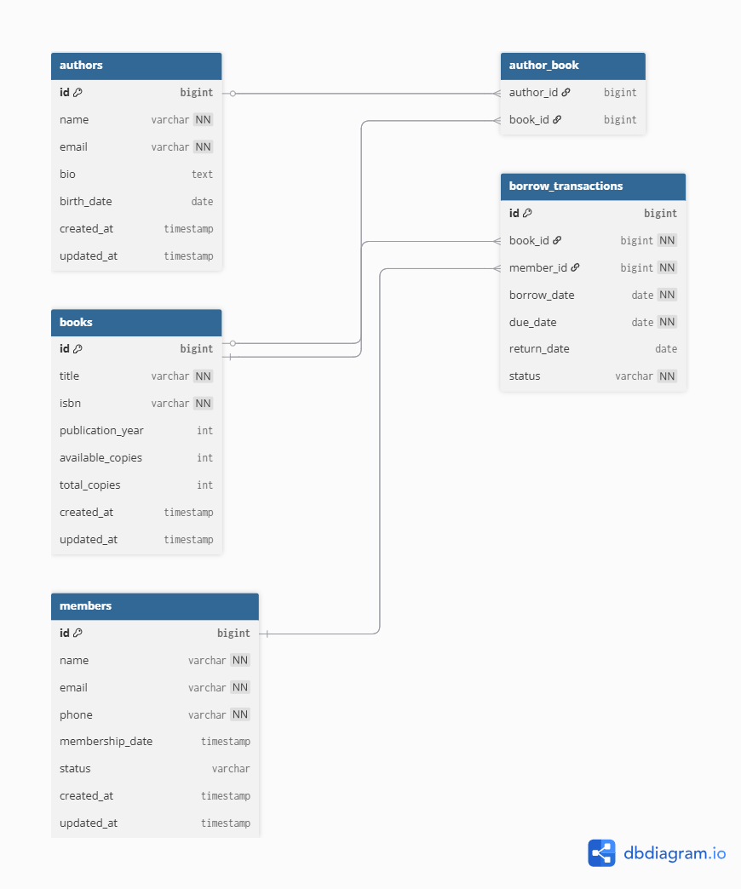

# Library Management System

A comprehensive Spring Boot REST API for managing a library system with books, authors, members, and borrow transactions.

## 📋 Table of Contents

- [Features](#features)
- [Prerequisites](#prerequisites)
- [Installation & Setup](#installation--setup)
- [Running the Application](#running-the-application)
- [API Documentation](#api-documentation)
- [Database](#database)
- [Testing](#testing)
- [Project Structure](#project-structure)
- [Built With](#built-with)
- [Contributing](#contributing)

## 🚀 Features

- **Book Management**: Add, update, delete, and search books
- **Author Management**: Manage author information and book associations
- **Member Management**: Register and manage library members
- **Borrow Transactions**: Handle book borrowing and returning
- **Search & Filtering**: Search books by title, ISBN, or author
- **Validation**: Comprehensive input validation
- **Error Handling**: Centralized exception handling
- **In-Memory Database**: H2 database for easy development and testing

## 📋 Prerequisites

Before running this application, make sure you have:

- **Java 17** or higher
- **Maven 3.6+** (or use the included Maven wrapper)
- **Git** (for cloning the repository)

## 🛠️ Installation & Setup

### 1. Clone the Repository

```bash
git clone https://github.com/sayedsiddique/Library-Management-System---Backend-Project.git
cd Library-Management-System---Backend-Project
```

### 2. Verify Java Version

```bash
java -version
```

Make sure you have Java 17 or higher installed.

### 3. Build the Project

Using Maven wrapper (recommended):

```bash
# On Windows
.\mvnw clean install

# On Unix/Linux/Mac
./mvnw clean install
```

Or using system Maven:

```bash
mvn clean install
```

## 🏃‍♂️ Running the Application

### Method 1: Using Maven Wrapper

```bash
# On Windows
.\mvnw spring-boot:run

# On Unix/Linux/Mac
./mvnw spring-boot:run
```

### Method 2: Using JAR File

```bash
# Build the JAR file
.\mvnw clean package

# Run the JAR file
java -jar target/demo-0.0.1-SNAPSHOT.jar
```

### Method 3: Using IDE

Import the project into your IDE (IntelliJ IDEA, Eclipse, VS Code) and run the `DemoApplication.java` file.

## 🌐 Application Access

Once the application is running:

- **API Base URL**: `http://localhost:8080/api`
- **H2 Database Console**: `http://localhost:8080/h2-console`
  - JDBC URL: `jdbc:h2:mem:test`
  - Username: `sa`
  - Password: (leave blank)

## 📚 API Documentation

The API provides comprehensive endpoints for managing all aspects of the library system:

### Available Endpoints

- **Book Management**: CRUD operations for books, search functionality
- **Author Management**: Manage authors and their book associations
- **Member Management**: Handle library member registration and management
- **Borrow Transactions**: Process book borrowing and returning

### API Documentation Resources

#### Swagger/OpenAPI Documentation

Interactive API documentation available at `/swagger-ui.html`.

#### Postman Collection

A complete Postman collection with example requests is available:
- Import the collection: `V1.postman_collection.json`
- Includes pre-configured requests for all endpoints
- Contains example request bodies and expected responses
- Environment variables for easy testing

*For complete API documentation with request/response examples, please refer to the Postman collection or Swagger documentation.*

## 🗄️ Database

The application uses an in-memory H2 database with pre-populated sample data:

- **5 Authors**: Including J.K. Rowling, George Orwell, Jane Austen, Mark Twain, and Harper Lee
- **15 Books**: Classic literature titles
- **30 Members**: Sample library members
- **Author-Book Relationships**: Many-to-many relationships between authors and books

### Database Schema

The application includes the following main entities:



- **Books**: `id`, `title`, `isbn`, `publication_year`, `available_copies`, `total_copies`
- **Authors**: `id`, `name`, `email`, `bio`, `birth_date`
- **Members**: `id`, `name`, `email`, `phone`, `status`, `membership_date`
- **Borrow Transactions**: `id`, `member_id`, `book_id`, `borrow_date`, `due_date`, `return_date`, `status`
- **Author-Book**: Join table for many-to-many relationship

## 📁 Project Structure

```
src/
├── main/
│   ├── java/com/example/demo/
│   │   ├── controller/          # REST controllers
│   │   ├── dto/                 # Data Transfer Objects
│   │   ├── exception/           # Custom exceptions and handlers
│   │   ├── model/               # JPA entities
│   │   ├── repository/          # Data access layer
│   │   ├── request/             # Request DTOs
│   │   ├── service/             # Business logic
│   │   ├── specification/       # JPA specifications
│   │   ├── validation/          # Custom validators
│   │   └── DemoApplication.java # Main application class
│   └── resources/
│       ├── application.yml      # Application configuration
│       └── data.sql             # Sample data
└── test/
    └── java/com/example/demo/
        └── DemoApplicationTests.java
```

## 🔧 Built With

- **Spring Boot 3.3.3** - Main framework
- **Spring Data JPA** - Data persistence
- **Spring Web** - REST API
- **Spring Validation** - Input validation
- **H2 Database** - In-memory database
- **Maven** - Dependency management
- **Java 17** - Programming language

## 📝 API Response Format

All API responses follow a consistent format:

```json
{
  "message": "Success message",
  "status": "success",
  "code": 200,
  "data": {
    // Response data
  }
}
```

## 🚨 Error Handling

The application includes comprehensive error handling for:

- **Resource Not Found** (404)
- **Validation Errors** (400)
- **Duplicate Email** (409)
- **Book Not Available** (409)
- **Borrow Limit Exceeded** (409)
- **Duplicate Borrow** (409)
- **Duplicate ISBN** (409)
- **Invalid Date** (400)

## 🔄 Business Rules

- Members can borrow multiple books
- Books must be available to be borrowed
- Members must be active to borrow books
- Due dates must be after borrow dates
- ISBN format validation (ISBN-10 or ISBN-13)
- Email uniqueness for authors and members
